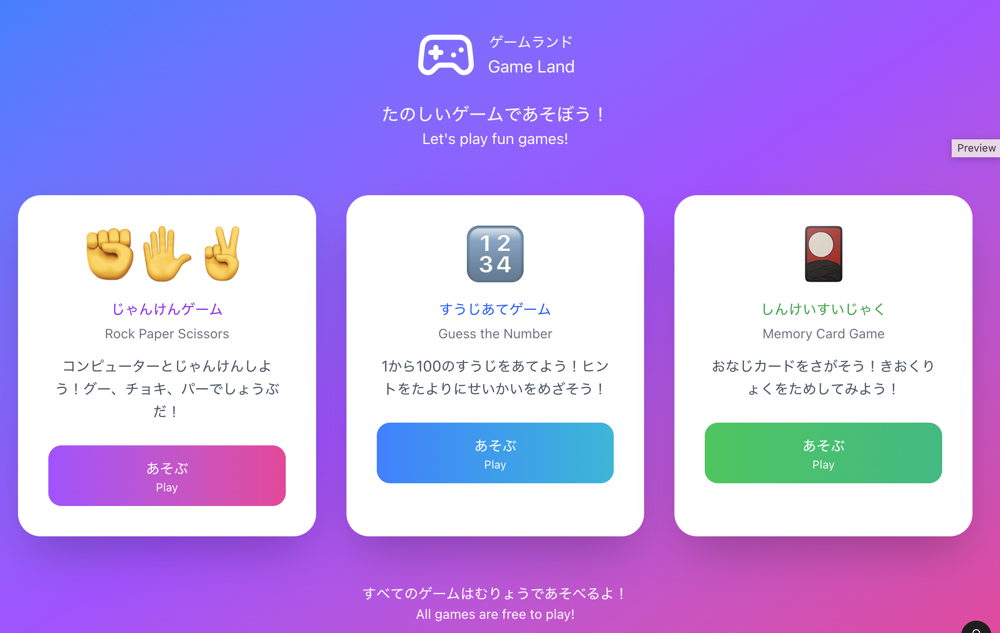
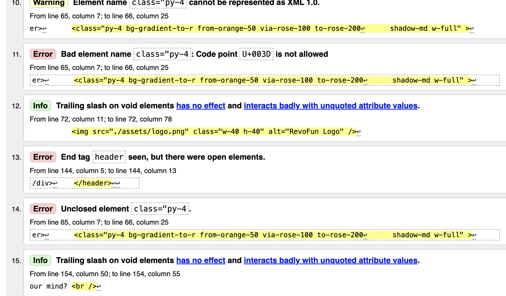

# RevoFun – Mini Game Website

RevoFun is a collection of simple browser-based games created as part of RevoU Full Stack Software Engineering – Milestone 2.
The goal of this project is to practice basic JavaScript, DOM manipulation, event handling, and UI building using Tailwind CSS.

While this began as a learning project, it became something more personal.
I dedicated this to my children — so they can play something their Mama
built, share it with their friends, and proudly say, “This is my Mama’s made game.”

Live Website: **https://revou-fsse-oct25.github.io/milestone-2-liaro25/**  
Repository: **https://github.com/Revou-FSSE-Oct25/milestone-2-liaro25**

---

## 1. Project Overview

RevoFun is a playful landing page that links to three mini-games:

- 👊🖐️✌️ Rock • Paper • Scissors (Shoot!)
- 1️⃣2️⃣3️⃣ Guess the Number (Guess!)
- 🍕🍔🍟 Memory Card Game (Match!)

### The objective of this project:

- Practice JavaScript fundamentals
- Learn how to use functions, conditions, loops, event listeners, and game logic
- Apply HTML and Tailwind CSS for styling learned in Milestone-1
- Understand how to structure a multi-page game website

## 2. Project Features

### General Features

- Responsive UI built using Tailwind CSS
- Soft pastel theme and custom logo for kid-friendly design
- Navigation bar + gradient header & footer and hamburger menu using JavaScript in responsive webpage
- Gaming landing page website with three game pages (Shoot!, Guess!, Match!)

### Rock • Paper • Scissors (Shoot!)

1. Click-based hand selection (✊ ✋ ✌️)
2. Computer random choice generator
3. Scoreboard: Player, Computer, Draw
4. Round result announcement
5. First to reach 3 points wins
6. Reset Game button
7. State management for score & round flow

### Guess the Number (Guess!)

1. Random number generation
2. User input validation
3. Feedback system (Too high / too low / correct)
4. Attempt counter
5. Reset option

### Memory Card Game (Match!)

1. Grid-based memory tiles 8 pair memory card
2. Flip card animation (CSS + JS)
3. Match checking logic
4. Win condition (all pairs found)
5. Finishing time showed

## 3. Technologies Used

| Category               | Tools / Technologies | Description                                         |
| ---------------------- | -------------------- | --------------------------------------------------- |
| **Design**             | Figma                | Initial wireframes and UI planning                  |
|                        | Canva                | Custom logo creation                                |
| **Development**        | HTML5                | Page structure                                      |
|                        | Tailwind CSS         | Styling (first Tailwind project)                    |
|                        | JavaScript (Vanilla) | Game logic and interactions                         |
|                        | GitHub Pages         | Deployment for the project                          |
| **Validation & QA**    | W3C HTML Validator   | Checking HTML structure and tag correctness         |
| **Learning Resources** | ChatGPT & Gemini     | Naming ideas, wording, refactoring, and code review |
|                        | Sololearn            | Learning JavaScript fundamentals through exercises  |
|                        | YouTube Tutorials    | Step-by-step game-building guides                   |

### Game Making Tutorials

- Web Development Tutorial - JavaScript, HTML, CSS - Rock Paper Scissors Game - https://www.youtube.com/watch?v=jaVNP3nIAv0
- Build Memory Game Project | HTML CSS JavaScript Fun Game for Beginners 2025 - https://www.youtube.com/watch?v=rcWBLFXH7uA
- Guess the Number Game Project | Revou Interactive Demo Session Week 7 Guess the Number github repository.
- Add a Sound Effect After Clicking on Buttons | HTML | CSS | JavaScript - https://youtu.be/C6G3ZERMi08?si=EpZXdnkAF7ma3wgp

---

## 4. Pseudocode and FlowChart for each games

### Rock • Paper • Scissors (Shoot!)

<p>Initialize playerScore, computerScore, drawCount = 0 <br>
When player clicks a choice:<br>
Generate random computer choice<br>
Compare choices<br>
If player wins, increment playerScore<br>
If computer wins, increment computerScore<br>
If draw, increment drawCount<br>
Update scoreboard<br>
If either score reaches 3:<br>
Display winner and allow reset</p>

### Guess the Number (Guess!)

<p>Generate random number between 1 and 100<br>
Set attempts = 10
</p>
<p>When player submits a guess:<br>
Increment attempts<br>
If guess < random number: show "Too low"<br>
If guess > random number: show "Too high"<br>
If guess == random number: show "Correct"<br>
Allow reset to restart game</p>

### Memory Card Game (Match!)

<p>Create 8 pair cards<br>
Shuffle list<br>
Render cards face down
</p>
<p>When first card is flipped:<br>
Store the card<br>
When second card is flipped:<br>
Compare both cards<br>
If match: keep flipped<br>
Else: flip both back after delay<br>
Repeat until all matches found<br>
Display win message</p>

## 5. Folder Structure

```
milestone-2-liaro25
├── assets
│   ├── figma.png
│   ├── guess.png
│   ├── logo.png
│   ├── match.png
│   └── shoot.png
├── guess.html
├── index.html
├── js
│   ├── guess.js
│   ├── howler.min.js
│   ├── match.js
│   ├── script.js
│   └── shoot.js
├── match.html
├── README.md
├── shoot.html
└── sounds
    ├── click.wav
    ├── flip.mp3
    ├── lose.mp3
    └── win.mp3
```

## 6. Screenshot Journey

This section documents the development journey of RevoFun, from initial ideas to implementation and testing.

1. **Raw imagination & planning**  
   Started by writing down raw ideas and rough concepts before any coding, including simple notes and pseudocode to clarify game logic and flow. Can be seen in _4. Pseudocode and FlowChart for each games_

2. **UI exploration & visual direction**  
   Designed early UI concepts in Figma to explore layout, colors, and overall feel of the games.  
   Created a simple logo and visual assets using Canva to establish a playful and consistent look.

   

3. **Implementation & experimentation**  
   Built each game page using JavaScript, learning through a combination of tutorials, documentation, AI assistance, and hands-on experimentation in VS Code. Can be seen in _Game Making Tutorials_
   Actively tested understanding by removing or modifying code blocks to observe their effects and better grasp how each part works.

4. **User testing & feedback**  
   Conducted informal user testing sessions, gathering feedback, critiques, and suggestions to improve usability and overall experience.

5. **Debugging & validation**  
   Verified the project in the browser at _W3C HTML Validator_ and development tools to identify potential issues such as missing brackets, logic errors, or console warnings, ensuring each file runs correctly and consistently.

   

## 7. Improvements & Refactoring

### Priority 1 — Bug Fix & Clean-up

- Fixed unclosed HTML tags in mobile navigation to prevent DOM and layout issues.
- Removed duplicated CSS class definitions for cleaner and more maintainable styles.

### Priority 2 — Code Quality Improvements

- Replaced magic numbers with named constants for better readability and scalability.
- Replaced browser alert() with in-page custom UI feedback for a smoother user experience.

### Priority 3 — Scalability & Future-proofing

- Refactored the Memory Card game to generate cards dynamically using JavaScript instead of hardcoded HTML.
- This allows easier changes to card count, themes, and difficulty levels in future updates.

### Priority 4 – Sound Effects

RevoFun uses **Howler.js** as a global sound manager to handle audio feedback consistently across all mini-games, including win, lose, button click, and card flip sounds.  
The library ensures reliable cross-browser and mobile audio playback, improving user experience across devices.
To support iOS devices, audio playback is unlocked through an initial user interaction (tap/click), complying with iOS Safari’s autoplay restrictions and ensuring sound works properly on iPhone and iPad.

> Audio handled using Howler.js (https://github.com/goldfire/howler.js)

## 8. Future Development Plans

- Add animations to enhance gameplay
- Implement a Top 5 leaderboard with player names and scores (using localStorage)
- Add Easy, Medium and Hard option in Match!
- Implement bilingual (English / Japanese) game interfaces to allow the games to be played by both international users and Japanese children.

[](https://classroom.github.com/a/PAiQDgnZ)
